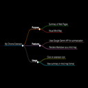

# tldr.map Chrome Extension

<div align="center">
  
  
  **Transform web pages into visual mind maps instantly**
  
  [](https://chromewebstore.google.com/detail/tldrmap/kplijcfeflnedbanohjjpnaoldoclgmc?authuser=0&hl=en)
  [](https://github.com/your-username/tldrmap)
  [](LICENSE)
</div>

## 🌟 Overview

The tldr.map Extension is a Chrome extension designed to help users create visual mind maps from web pages <mcreference link="https://chromewebstore.google.com/detail/tldrmap/kplijcfeflnedbanohjjpnaoldoclgmc?authuser=0&hl=en" index="0">0</mcreference>. It leverages the Google Gemini API for summarization and Markmap for rendering interactive mind maps, providing a user-friendly interface with features like API key management, customizable prompts, and dark mode support.

## 🚀 Features

### Core Functionality
- **AI-Powered Summarization**: Uses Google Gemini API to extract key information from web pages <mcreference link="https://tldrmap.vercel.app/" index="1">1</mcreference>
- **Interactive Mind Maps**: Renders beautiful, interactive mind maps using Markmap library
- **Real-time Processing**: Instant transformation of text content into visual mind maps
- **Markdown Support**: Visualizes markdown files as interactive maps <mcreference link="https://tldrmap.vercel.app/" index="1">1</mcreference>

### User Interface
- **Clean, Modern Design**: Intuitive popup interface with easy-to-use controls
- **Dark Mode Support**: Toggle between light and dark themes
- **Responsive Layout**: Optimized for various screen sizes
- **Visual Feedback**: Loading indicators and toast notifications

### Customization Options
- **API Key Management**: Secure storage and management of your Gemini API key
- **Custom Prompts**: Set default prompts for consistent summarization style
- **Export Functionality**: Download mind maps as images
- **Settings Panel**: Easy access to configuration options

## 🔗 Links

- **Chrome Web Store**: [Install Extension](https://chromewebstore.google.com/detail/tldrmap/kplijcfeflnedbanohjjpnaoldoclgmc?authuser=0&hl=en)
- **Web Version**: [tldrmap.vercel.app](https://tldrmap.vercel.app/)
- **Support**: [Ko-fi](https://ko-fi.com/X7X616PGB7)

## 📦 Installation

### From Chrome Web Store (Recommended)
1. Visit the [Chrome Web Store page](https://chromewebstore.google.com/detail/tldrmap/kplijcfeflnedbanohjjpnaoldoclgmc?authuser=0&hl=en)
2. Click "Add to Chrome"
3. Confirm the installation when prompted

### Manual Installation (Development)
1. Clone this repository:
   ```bash
   git clone https://github.com/your-username/tldrmap.git
   cd tldrmap
   ```

2. Open Chrome and navigate to `chrome://extensions/`

3. Enable "Developer mode" in the top right corner

4. Click "Load unpacked" and select the extension directory

## 🛠️ Setup

### 1. Get a Google Gemini API Key
1. Visit [Google AI Studio](https://makersuite.google.com/app/apikey)
2. Create a new API key
3. Copy the generated key

### 2. Configure the Extension
1. Click the tldr.map extension icon in your browser toolbar
2. Click the settings button (⚙️)
3. Enter your API key in the provided field
4. Optionally, customize the default prompt
5. Save your settings

## 🎯 Usage

### Basic Usage
1. **Navigate** to any web page you want to summarize
2. **Click** the tldr.map extension icon in your toolbar
3. **Click** the map generation button (🗺️)
4. **Wait** for the AI to process the content
5. **Explore** your interactive mind map!

### Advanced Features
- **Custom Prompts**: Modify the default prompt in settings to get summaries tailored to your needs
- **Dark Mode**: Toggle between light and dark themes using the moon/sun button
- **Export**: Download your mind map as an image using the download button
- **Zoom & Pan**: Navigate large mind maps with mouse controls

## 🏗️ Project Structure

```
tldrmap/
├── manifest.json          # Extension configuration
├── popup.html             # Main popup interface
├── popup.js               # Core functionality and UI logic
├── popup.css              # Styling and themes
├── background.js          # Service worker for background tasks
├── content-scripts.js     # Content script for web page interaction
├── icons/                 # Extension icons and UI assets
│   ├── icon16.png
│   ├── icon32.png
│   ├── icon48.png
│   ├── icon128.png
│   └── *.svg             # UI icons
├── libs/                  # Third-party libraries
│   ├── d3.js             # D3.js for visualization
│   ├── mark-map-lib.js   # Markmap core library
│   ├── mark-map-view.js  # Markmap view components
│   ├── mark-map-toolbar.js # Markmap toolbar
│   └── html-to-image.js  # Image export functionality
└── test_*.html/js        # Test files for development
```

## 🔧 Development

### Prerequisites
- Chrome browser
- Text editor or IDE
- Basic knowledge of JavaScript, HTML, and CSS

### Local Development
1. Clone the repository
2. Make your changes to the source files
3. Load the extension in Chrome using Developer mode
4. Test your changes by reloading the extension

### Key Files to Modify
- **popup.js**: Main application logic and API integration
- **popup.css**: Styling and theme customization
- **popup.html**: UI structure and layout
- **manifest.json**: Extension permissions and configuration

## 🤝 Contributing

Contributions are welcome! Please feel free to submit a Pull Request. For major changes, please open an issue first to discuss what you would like to change.

### Development Guidelines
1. Follow the existing code style and conventions
2. Test your changes thoroughly
3. Update documentation as needed
4. Ensure all features work in both light and dark modes

## 📄 License

This project is licensed under the MIT License - see the [LICENSE](LICENSE) file for details.

## 💖 Support

If you find this extension helpful, consider supporting the developer:

[](https://ko-fi.com/X7X616PGB7)

## 🐛 Issues & Feedback

If you encounter any issues or have suggestions for improvements, please:
1. Check the existing issues on GitHub
2. Create a new issue with detailed information
3. Include steps to reproduce any bugs

## 🔄 Version History

- **v0.0.0.3** - Current version with improved stability and features
- Previous versions available in release history

---

<div align="center">
  Made with ❤️ for better web content consumption
</div>